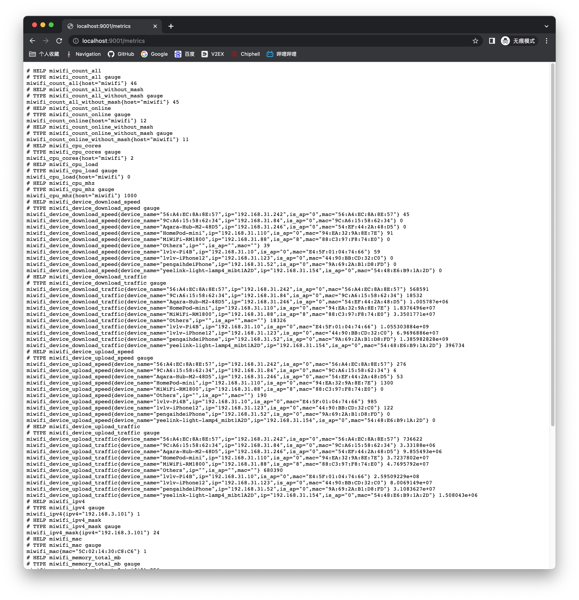
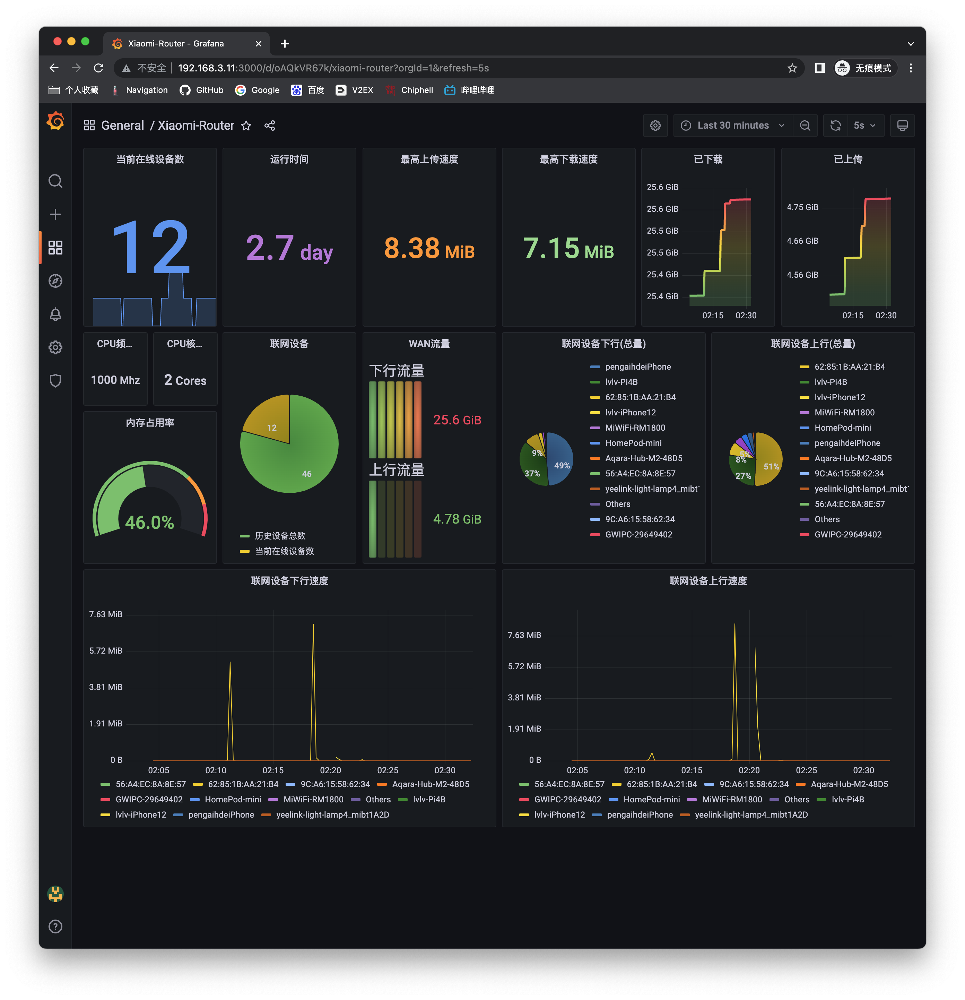

# miwifi_exporter

### Screenshot





### Usage

See ```docker-compose.yml```.

```shell
docker compose build
docker compose up -d
```

### Grafana dashboard

See  https://grafana.com/grafana/dashboards/16557-xiaomi-router/


### Collectors

| Name                      | Example                                                                                                                                                                                                                                                                       |
|---------------------------|-------------------------------------------------------------------------------------------------------------------------------------------------------------------------------------------------------------------------------------------------------------------------------|
| cpu_cores                 | miwifi_cpu_cores{host="Redmi-AX6S"} 2                                                                                                                                                                                                                                         |
| cpu_mhz                   | miwifi_cpu_mhz{host="Redmi-AX6S"} 1000                                                                                                                                                                                                                                        |
| cpu_load                  | miwifi_cpu_load{host="Redmi-AX6S"} 0 (This value always 0, 💩Xiaomi)                                                                                                                                                                                                          |
| memory_total_mb           | miwifi_memory_total_mb{host="Redmi-AX6S"} 256                                                                                                                                                                                                                                 |
| memory_usage_mb           | miwifi_memory_usage_mb{host="Redmi-AX6S"} 115.2                                                                                                                                                                                                                               |
| memory_usage              | miwifi_memory_usage{host="Redmi-AX6S"} 0.45                                                                                                                                                                                                                                   |
| count_all                 | miwifi_count_all{host="Redmi-AX6S"} 46                                                                                                                                                                                                                                        |
| count_online              | miwifi_count_online{host="Redmi-AX6S"} 12                                                                                                                                                                                                                                     |
| count_all_without_mash    | miwifi_count_all_without_mash{host="Redmi-AX6S"} 45 (I think it should be "mesh")                                                                                                                                                                                             |
| count_online_without_mash | miwifi_count_online_without_mash{host="Redmi-AX6S"} 11                                                                                                                                                                                                                        |
| uptime                    | miwifi_uptime{host="Redmi-AX6S"} 230035.3                                                                                                                                                                                                                                     |
| platform                  | miwifi_platform{platform="RB03"} 1                                                                                                                                                                                                                                            |
| version                   | miwifi_version{version="1.0.37"} 1                                                                                                                                                                                                                                            |
| sn                        | miwifi_sn{sn="xxx/xxxxx"} 1                                                                                                                                                                                                                                                   |
| mac                       | miwifi_mac{mac="5C:12:14:30:C8:C4"} 1                                                                                                                                                                                                                                         |
| ipv4                      | miwifi_ipv4{ipv4="192.168.3.101"} 1                                                                                                                                                                                                                                           |
| ipv4_mask                 | miwifi_ipv4_mask{ipv4="192.168.3.101"} 24                                                                                                                                                                                                                                     |
| ipv6                      | miwifi_ipv6{ipv6="2001:0db8:02de:0000:0000:0000:0000:0e13"} 1                                                                                                                                                                                                                 |
| wan_upload_speed          | miwifi_wan_upload_speed{host="Redmi-AX6S"} 2003                                                                                                                                                                                                                               |
| wan_download_speed        | miwifi_wan_download_speed{host="Redmi-AX6S"} 262                                                                                                                                                                                                                              |
| wan_upload_traffic        | miwifi_wan_upload_traffic{host="Redmi-AX6S"} 5.130555322e+09                                                                                                                                                                                                                  |
| wan_download_traffic      | miwifi_wan_download_traffic{host="Redmi-AX6S"} 2.7483196685e+10                                                                                                                                                                                                               |
| device_upload_traffic     | miwifi_device_upload_traffic{device_name="yeelink-light-lamp4_mibt1A2D",ip="192.168.31.154",is_ap="0",mac="54:48:E6:B9:1A:2D"} 1.519688e+06                                                                                                                                   |
| device_upload_speed       | miwifi_device_upload_speed{device_name="yeelink-light-lamp4_mibt1A2D",ip="192.168.31.154",is_ap="0",mac="54:48:E6:B9:1A:2D"} 0                                                                                                                                                |
| device_download_traffic   | miwifi_device_download_traffic{device_name="yeelink-light-lamp4_mibt1A2D",ip="192.168.31.154",is_ap="0",mac="54:48:E6:B9:1A:2D"} 400261                                                                                                                                       |
| device_download_speed     | miwifi_device_download_speed{device_name="yeelink-light-lamp4_mibt1A2D",ip="192.168.31.154",is_ap="0",mac="54:48:E6:B9:1A:2D"} 0                                                                                                                                              |
| wifi_detail               | miwifi_wifi_detail{band_list="20/40/80/160MHz",channel="48",ssid="XXX-5G-Game",status="1"} 1<br/> miwifi_wifi_detail{band_list="20/40/80MHz",channel="149",ssid="XXX-5G",status="1"} 1<br/>miwifi_wifi_detail{band_list="20/40MHz",channel="10",ssid="XXX-2.4G",status="1"} 1 |

### Source Repo

https://github.com/HuckOps/miwifi_exporter